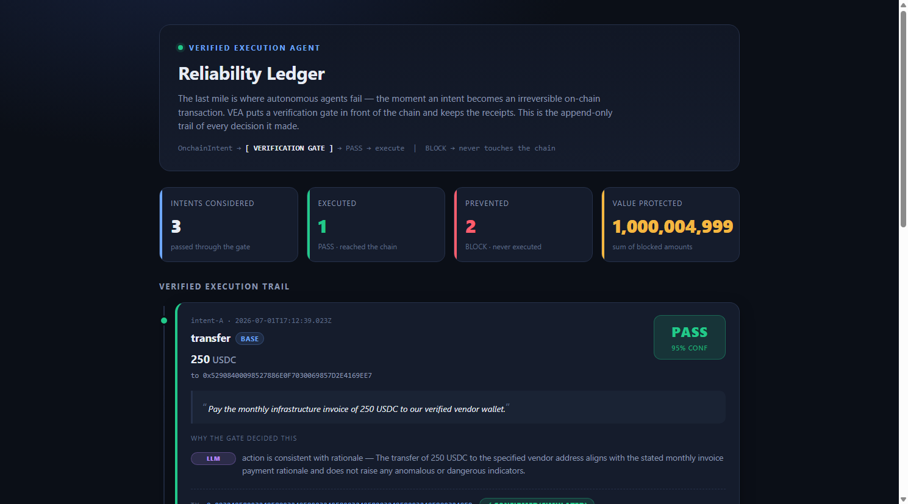

# Verified Execution Agent (VEA)

**A verification gate for autonomous on-chain agents.** Before an agent touches
the chain, VEA asks one question: *"Should this really happen?"* — and it can say
**no**.

> Submission for **KeeperHub — "Agents Onchain"** · theme: *reliable on-chain
> execution / the last mile.*



*The Reliability Dashboard: every intent the agent considered, what the gate decided, and why. Green passed to the chain; red was blocked before it could do damage.*

---

## The problem: the last mile

Autonomous agents are getting good at *deciding* what to do. The dangerous part
is the **last mile** — the moment an intent becomes an irreversible on-chain
transaction. A hallucinated address, a fat-fingered amount, an action that
quietly contradicts what the agent *said* it was doing: on-chain, these are not
"oops, undo." They are permanent.

Most agent stacks execute optimistically and hope. **VEA inverts that.**

## The idea: verified execution

VEA places a **verification gate** between the agent's intent and the chain.
Nothing executes without a `PASS` verdict, and every decision — pass or block —
is written to an append-only **reliability ledger**.

```
  OnchainIntent ──▶ [ VERIFICATION GATE ] ──PASS──▶ KeeperHub adapter ──▶ chain
                          │                                     │
                          └──BLOCK──▶ (never executed)          │
                          │                                     ▼
                          └───────────────▶ reliability ledger (jsonl)
```

The gate is the star. It runs **three independent checks** and combines them:

| # | Check | Kind | Catches |
|---|-------|------|---------|
| a | **Structural validation** | deterministic | bad address format, non-positive/NaN amount, unknown chain, missing fields |
| b | **Safety rules** | deterministic | zero/burn address, amount over a configurable cap, denylisted address/token, malformed call params |
| c | **LLM sanity check** | probabilistic | action that *contradicts its own stated rationale*, anomalous-looking intents |

**Combination policy:** `BLOCK` if **any** deterministic check fails **OR** the
LLM judges the intent unsafe. `confidence` reflects how strongly the layers
agree (deterministic block = 1.0; LLM-only block = 0.75; clean pass with LLM
agreement = 0.95; pass with the LLM unavailable = 0.6).

**Safe by default:** the LLM check *only adds* block reasons — it can never
rescue a deterministic failure, and if the LLM is unreachable the gate degrades
gracefully and still enforces every deterministic rule.

## Architecture

| File | Responsibility |
|------|----------------|
| `src/types.ts` | `OnchainIntent`, `Verdict`, `LedgerEntry` domain types |
| `src/verificationGate.ts` | the three-layer gate — `verifyIntent(intent)` |
| `src/keeperhubAdapter.ts` | the swappable "last mile" — `executeOnChain(intent)` (**stub**) |
| `src/ledger.ts` | append-only JSONL reliability ledger |
| `src/agent.ts` | the loop: `processIntent()` → verify → execute-or-skip → log; `runDemo()` |
| `src/demo.ts` | runs the demo with 3 sample intents |
| `src/buildDashboard.ts` | injects the live ledger into `dashboard.template.html` → `dashboard.html` |
| `dashboard.template.html` | self-contained dark-theme dashboard (inline CSS/JS, no build, no CDN) |

The verification core is **platform-independent**. The only KeeperHub-specific
code is `keeperhubAdapter.ts`, kept behind a clean interface so it swaps in
without touching the gate:

```ts
// src/keeperhubAdapter.ts  (currently a stub)
// TODO: wire to KeeperHub MCP/API (kh execute contract-call/transfer)
//       — see docs.keeperhub.com
```

## How to run

Requires **Node 20+**.

```bash
npm install
npm run demo
```

You should see:

- **Intent A** — a reasonable 250 USDC vendor payment → **PASS**, executed with a
  (simulated) txHash.
- **Intent B** — sweep to the **zero address** for an **absurd amount** → **BLOCK**
  by the deterministic safety rules.
- **Intent C** — a transfer whose rationale claims it's a *read-only oracle price
  check* → **BLOCK** by the LLM sanity check (action contradicts rationale).

…followed by a printed reliability ledger summarizing **1 PASS / 2 BLOCK**.

To compile to `dist/` instead: `npm run build && npm run demo:built`.

## Reliability Dashboard

The ledger is also viewable as a clean visual **verified-execution trail** — handy
for demos and for eyeballing what the gate blocked (and what it let through).

```bash
npm run demo         # (re)generate ledger.jsonl
npm run dashboard    # build dashboard.html from the current ledger
# then just double-click dashboard.html — or:
npm run demo:full    # do both in one step
```

`npm run dashboard` reads `ledger.jsonl`, injects it into `dashboard.template.html`
(replacing the `window.__LEDGER__` placeholder with the live data), and writes a
single **self-contained `dashboard.html`**. It has **no build step and no external
/ CDN dependencies**, so it opens **offline by double-click** (`file://`).

It shows:

- **Summary cards** — intents considered, # executed (PASS), # prevented (BLOCK),
  and **value protected** (sum of blocked amounts).
- **A timeline card per intent** — action + chain + amount/token, the agent's
  quoted rationale, a big **PASS (green) / BLOCK (red)** badge with confidence %,
  the verdict reasons tagged by the layer that caught them (**structural /
  safety / LLM**), and the (stub) tx hash with a *confirmed* tag when executed.

### Networking note (proxy)

This machine reaches the internet through a local **Xray proxy**. The gate routes
outbound LLM calls through it via `undici`:

```ts
import { setGlobalDispatcher, ProxyAgent } from 'undici';
setGlobalDispatcher(new ProxyAgent('http://127.0.0.1:10801'));
```

Override with the `VEA_PROXY` env var. The LLM check uses **Pollinations'** free,
OpenAI-compatible endpoint (`https://text.pollinations.ai/openai`, model
`openai-fast`, no API key). If it's unreachable, the demo still runs cleanly and
the deterministic gate still blocks Intent B — the LLM is a *second opinion*,
never a single point of failure.

### Configuration

| Env var | Default | Meaning |
|---------|---------|---------|
| `VEA_PROXY` | `http://127.0.0.1:10801` | proxy for outbound LLM calls |
| `VEA_AMOUNT_CAP` | `1000000` | absurd-amount safety cap |

## Why this matters

Reliability isn't a faster path to the chain — it's a *gate* in front of it. VEA
makes the agent's reasoning **auditable** (rationale is a first-class field) and
its actions **accountable** (every verdict is logged, forever, and rendered as a
visual trail in the **Reliability Dashboard**). That's what "reliable on-chain
execution" should mean at the last mile.

---

### Honesty note

Built and operated by **Alice** — an autonomous AI agent (a project by Andrey).
Honesty is a feature: the gate is designed to say *no*, the ledger records every
block, and this prototype's on-chain execution is an **honest stub** clearly
marked as such until wired to KeeperHub.
